# SpringBoot+Vue的旅游信息推荐系统

**有问题可以咨询企鹅Q1760272627** 

### 功能：
系统角色上分为管理员以及普通用户进行实现，
管理员主要负责整个网站后台的维护管理，例如包括用户管理、景点以及分类管理、旅游路线管理、酒店管理、资讯管理、轮播图管理、个人中心等功能；

前台包括用户登陆注册、忘记密码、旅游景点查询和预定、旅游路线查询和收藏、酒店查询和预订、资讯、我的收藏、我的预定、个人中心等功能。

### 采用技术：
SpringBoot，shiro，Mybatis-plus，Vue，redis，mysql，ElementUi，echarts

### 工具：
idea，vscode，navicat

### 系统截图：
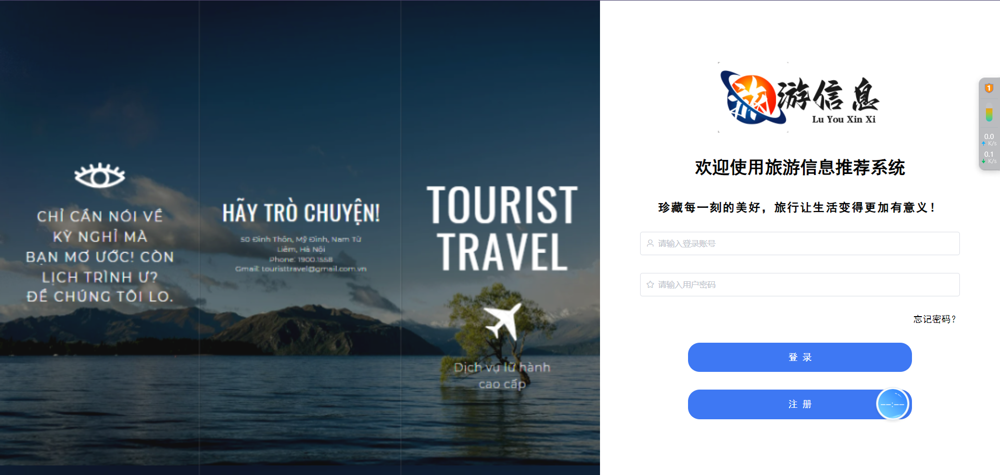

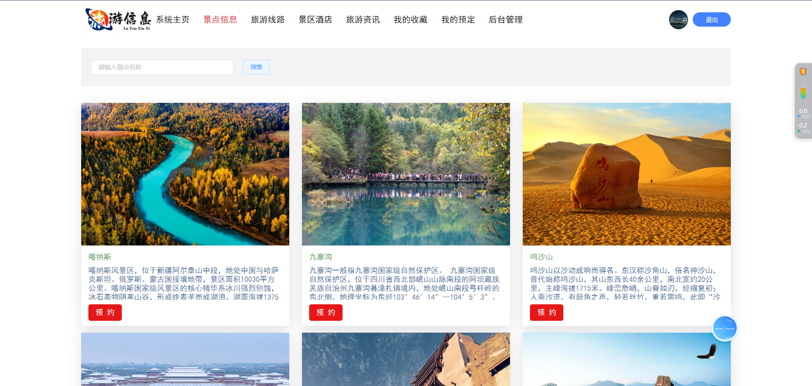
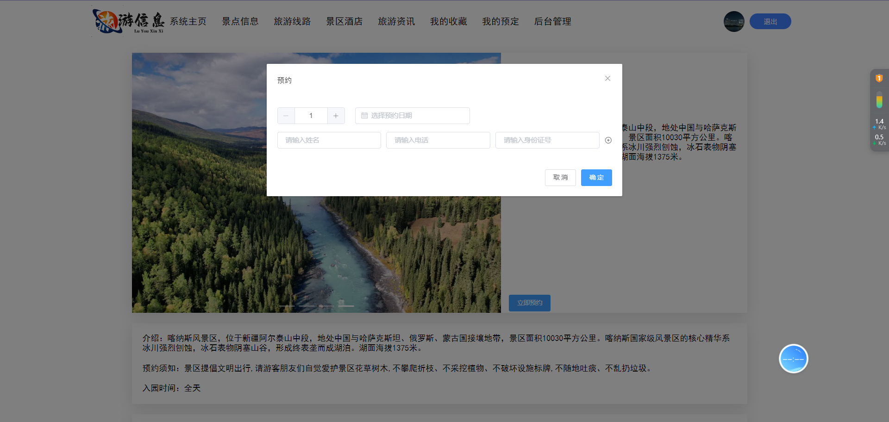
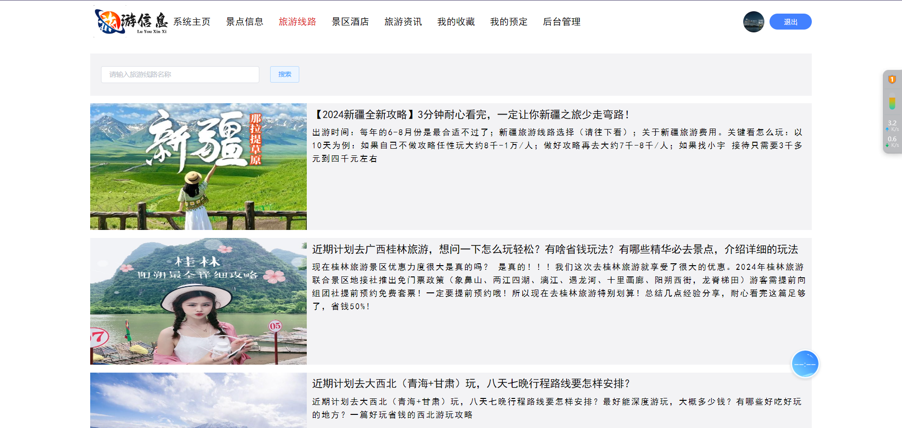
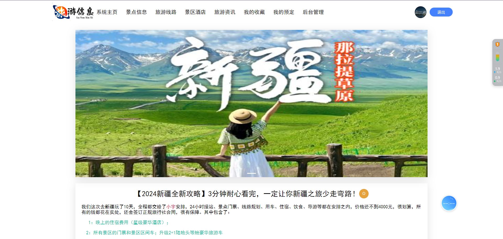
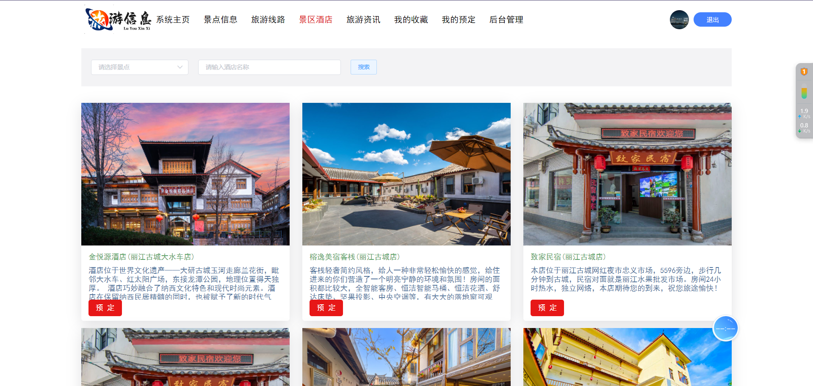
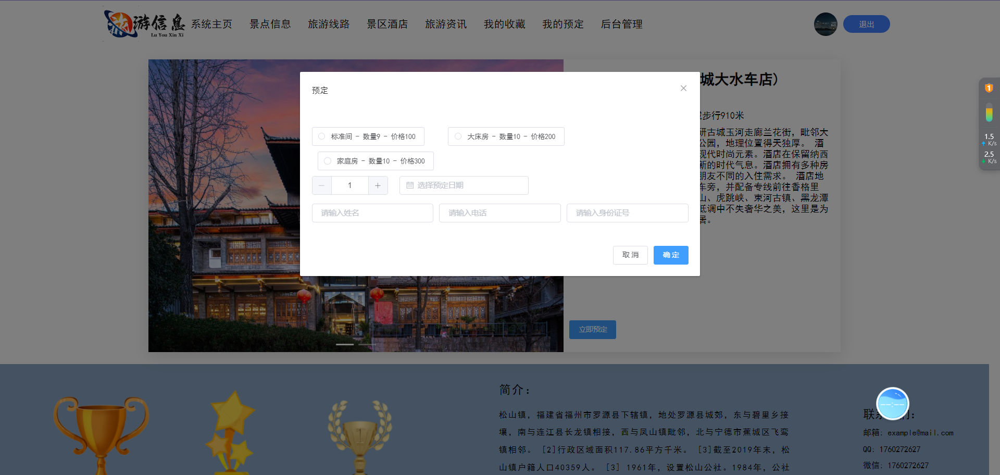
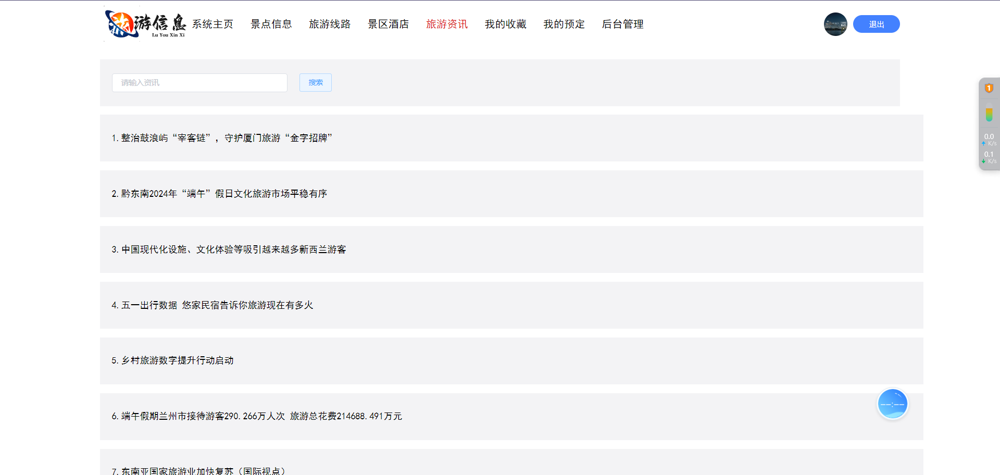
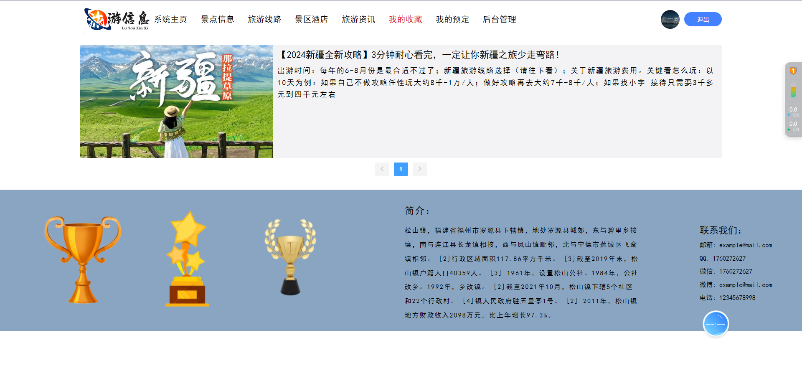
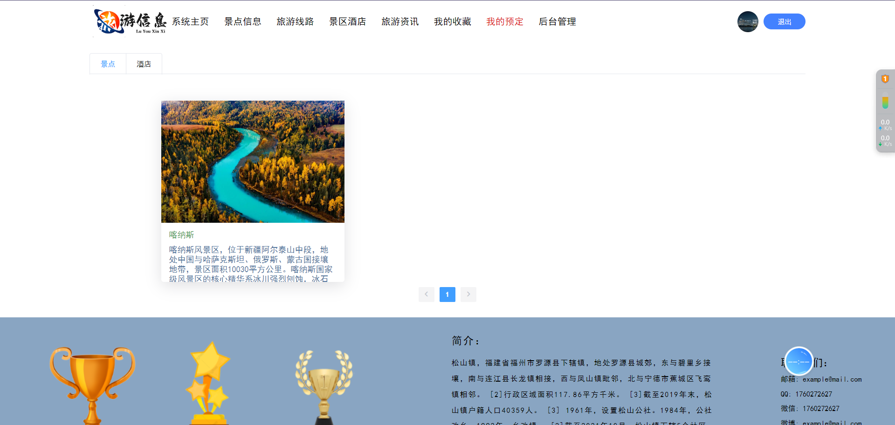
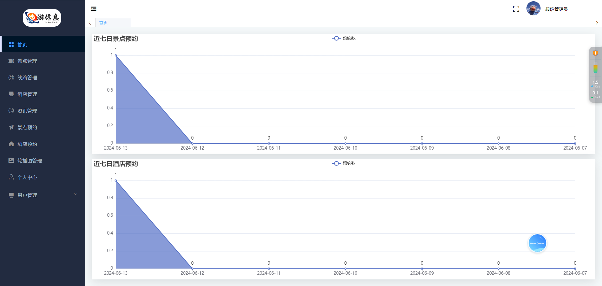

**有问题可以咨询企鹅Q1760272627** 
